# 身体健康智慧问答助手

一个面向健康科普场景的 RAG（Retrieval-Augmented Generation，检索增强生成）问答系统。项目以 Django + Vue 3 为主体，围绕“健康知识库检索、多轮问答、知识卡片、个性化推荐、后台管理”构建完整的前后端应用。

> 本项目用于健康科普与学习演示，不替代医生诊断、处方或急救建议。

## 项目亮点

- **健康 RAG 问答**：基于 Qdrant 向量检索召回知识片段，再结合大模型生成回答。
- **向量化知识库链路**：支持文档上传、切分、Embedding、向量入库、重建索引的完整闭环。
- **多轮追问理解**：支持“老人呢”“女性呢”这类短追问，结合会话上下文扩展检索问题。
- **领域 Query 扩展**：内置健康场景同义词扩展，可通过开关控制是否启用。
- **知识卡片生成**：每次回答后结构化展示核心要点、注意事项和参考来源。
- **个性化推荐**：根据用户近期问答主题推荐相关健康知识。
- **知识库后台管理**：支持文档上传、启停、删除、重建索引、检索调试。
- **RAGAS 一键评估**：后台支持点击启动 RAGAS 评估，输出忠实度、相关性等指标并落盘结果。
- **语音提问能力**：预留火山引擎 ASR 配置，支持浏览器录音转文字后问答。
- **系统管理后台**：用户、角色、菜单、通知、日志和系统监控等管理能力。

## 技术栈

| 模块 | 技术 |
| --- | --- |
| 后端 | Python、Django、Django REST Framework、Channels、Daphne |
| 前端 | Vue 3、Vite、TypeScript、Ant Design Vue、Pinia、Axios |
| 数据库 | SQLite（默认本地演示）、MySQL（可扩展） |
| 检索 | Qdrant 向量检索、OpenAI 兼容 Embedding、领域 Query 扩展 |
| 大模型 | OpenAI 兼容 API（可对接本地或云端服务） |
| 语音识别 | 火山引擎 ASR WebSocket（可选配置） |
| 导出 | ReportLab PDF |

## 框架来源与二次开发说明

本项目是基于 **Hertz Admin / Hertz Studio Django** 相关现成组件继续开发：

- 后端复用了 Hertz 的用户认证、角色权限、菜单管理、通知公告、操作日志、系统监控、统一响应和部分工具组件。
- 前端复用了 Hertz Admin 的管理端布局、权限路由、请求封装、主题样式和基础管理页面。
- 本项目的主要业务增量集中在 `health_rag_assistant` 健康 RAG 模块，以及对应的健康问答、知识库管理、知识卡片、推荐和模型配置页面。

如果环境中存在 Hertz 官方依赖清单，`start.py init` 会尝试通过 Hertz 私有源安装相关依赖：

```text
https://hzpypi.hzsystems.cn
```

该依赖源通常需要可访问网络和对应授权环境。

## 核心流程

```text
用户问题
  -> 会话上下文补全
  -> Query 扩展
  -> Embedding 向量化
  -> Qdrant 向量召回 + TF-IDF 稀疏召回
  -> RRF 融合 + Rerank 重排
  -> 构造 Prompt
  -> 调用 LLM
  -> 返回回答、引用片段、知识卡片
```

## 目录结构

```text
.
├── start.py                         # 项目初始化、启动、停止、状态查看脚本
├── backend/
│   ├── manage.py                    # Django 管理入口
│   ├── start_server.py              # Daphne 后端启动器
│   ├── requirements.txt             # 后端依赖
│   ├── .env.example                 # 环境变量示例，不包含真实密钥
│   ├── data/                        # 本地运行数据
│   ├── hertz_server_django/         # Django 项目配置、路由、ASGI 入口
│   ├── health_rag_assistant/        # 健康 RAG 核心业务模块
│   │   ├── models.py                # 会话、问答记录、知识库文档等模型
│   │   ├── views.py                 # API 视图
│   │   ├── urls.py                  # RAG API 路由
│   │   ├── services/                # RAG、检索、LLM、推荐、ASR、PDF 等服务
│   │   ├── management/commands/     # 知识库初始化命令
│   │   └── datasets/                # 内置健康语料
│   ├── hertz_studio_django_auth/    # 登录、权限、用户体系
│   ├── hertz_studio_django_log/     # 操作日志
│   ├── hertz_studio_django_notice/  # 通知公告
│   └── hertz_studio_django_system_monitor/
│
└── frontend/
    ├── package.json
    ├── vite.config.ts
    └── src/
        ├── api/                     # 前端 API 封装
        ├── router/                  # 路由
        ├── stores/                  # Pinia 状态
        ├── views/user_pages/        # 用户端健康问答页面
        └── views/admin_page/        # 后台管理页面
```

## 快速开始

### 1. 环境要求

- Python 3.11+
- Node.js 18+
- Windows PowerShell / macOS / Linux Shell
- 可选：Redis、本地或云端 OpenAI 兼容模型服务

### 2. 配置环境变量

复制示例配置：

```bash
copy backend\.env.example backend\.env
```

Linux/macOS：

```bash
cp backend/.env.example backend/.env
```

推荐使用以下变量（LLM 与 Embedding 可指向同一 OpenAI 兼容服务）：

```env
LLM_BASE_URL=https://api.example.com/v1
LLM_API_KEY=sk-xxx
LLM_MODEL=deepseek-chat
LLM_TIMEOUT=60

EMBEDDING_BASE_URL=https://api.example.com/v1
EMBEDDING_API_KEY=sk-xxx
EMBEDDING_MODEL=text-embedding-v4
EMBEDDING_TIMEOUT=30
EMBEDDING_BATCH_SIZE=64

QDRANT_URL=http://127.0.0.1:6333
QDRANT_COLLECTION=health_rag_chunks
QDRANT_TIMEOUT=15
RAG_TOP_K=5
RAG_ENABLE_QUERY_EXPANSION=True
```

请不要把真实的 `backend/.env`、API Key、数据库文件提交到 GitHub。

### 3. 初始化依赖

```bash
python start.py init
```

该命令会创建后端虚拟环境、安装 Python 依赖，并执行前端 `npm install`。

### 4. 启动项目

```bash
python start.py
```

或显式运行：

```bash
python start.py start
```

默认地址：

- 前端：http://127.0.0.1:3000
- 后端：http://127.0.0.1:8000

启动后日志会直接显示在当前终端。按 `Ctrl+C` 可停止本次由 `start.py` 启动的前后端进程。

`start.py` 启动链路已校验：可正常拉起后端 `8000` 与前端 `3000`。

### 5. 查看或停止服务

```bash
python start.py status
python start.py stop
```

`stop` 会停止占用 8000 和 3000 端口的进程，使用前请确认这两个端口确实属于本项目。

## 初始化知识库

进入后端目录后可执行：

```bash
cd backend
venv\Scripts\python manage.py import_cmedqa_to_kb --reindex
```

如只需把已入库文档重建向量索引：

```bash
cd backend
venv\Scripts\python manage.py rebuild_health_rag_vectors
```

Linux/macOS：

```bash
cd backend
./venv/bin/python manage.py import_cmedqa_to_kb --reindex
```

初始化后可以在后台知识库页面查看文档，也可以上传新的 `txt` / `md` 文档并重建索引。

如需生成固定评测集（不参与知识库导入）：

```bash
cd backend
venv\Scripts\python manage.py build_cmedqa_eval_set --limit 100 --seed 2026 --output health_eval_questions_cmedqa_v1.jsonl
```

## 评估与调试

### 1. 终端评估命令

```bash
cd backend
venv\Scripts\python manage.py evaluate_health_rag
venv\Scripts\python manage.py evaluate_health_rag_ragas --input health_eval_questions_cmedqa_v1.jsonl --limit 20 --top-k 5
```

### 2. 后台一键启动 RAGAS

进入管理后台：

`/admin/health-rag-retrieval-debug`

在页面顶部 `RAGAS 评估` 区域填写：

- `input`：评测文件名（默认 `health_eval_questions_cmedqa_v1.jsonl`）
- `top_k`
- `limit`

点击 `启动 RAGAS 评估` 后，页面会返回耗时、输出日志和结果文件路径。

### 3. 本地评估留档

可把终端输出保存到：

`backend/health_rag_assistant/datasets/eval/results/`

示例留档文件：

`evaluate_health_rag_run_20260523_183757.txt`

## 默认账号

| 角色 | 用户名 | 密码 |
| --- | --- | --- |
| 超级管理员 | hertz | hertz |
| 普通用户 | demo | 123456 |

如数据库重新初始化，账号以实际初始化脚本或数据库内容为准。

## 主要接口

健康 RAG 接口前缀：`/api/health-rag/`

| 接口 | 方法 | 说明 |
| --- | --- | --- |
| `health/` | GET | 健康检查 |
| `chat/ask/` | POST | 提交健康问题 |
| `chat/sessions/` | GET | 获取会话列表 |
| `chat/sessions/create/` | POST | 新建会话 |
| `chat/history/` | GET | 获取问答历史 |
| `chat/history/export/pdf/` | POST | 导出历史 PDF |
| `chat/transcribe/` | POST | 语音转写 |
| `recommend/` | GET | 个性化推荐 |
| `kb/documents/` | GET | 知识库文档列表 |
| `kb/documents/create/` | POST | 上传知识文档 |
| `kb/documents/update/` | POST | 更新知识文档 |
| `kb/documents/delete/` | POST | 删除知识文档 |
| `kb/reindex/` | POST | 重建知识库索引 |
| `retrieval/debug/` | POST | 检索调试（返回改写后 query 和命中结果） |
| `eval/ragas/run/` | POST | 后台点击启动 RAGAS 评估 |
| `model/status/` | GET | 查看模型状态 |
| `model/status/custom/` | POST | 检查自定义模型配置 |
| `model/switch/` | POST | 切换模型配置 |
| `model/restart/` | POST | 重启模型连接 |

## 当前项目边界

- 系统提供健康科普问答能力，不提供医疗诊断结论。
- LLM 服务不可用时，系统会返回知识库检索片段作为兜底参考。
- 语音识别依赖第三方 ASR 配置，未配置时不影响文字问答。
- SQLite 适合本地演示；多人协作或线上部署建议切换到 MySQL/PostgreSQL，并单独配置 Redis。

## 运行截图

### 登录与用户端

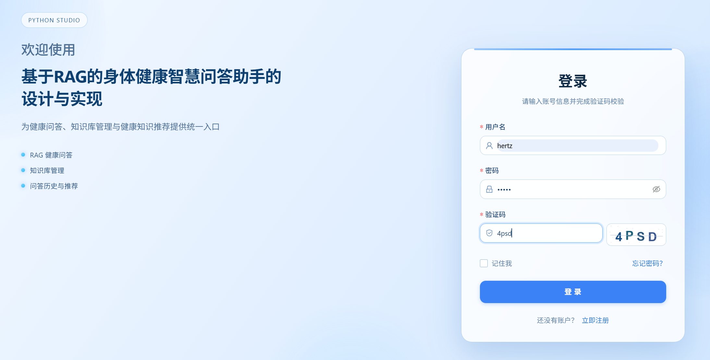

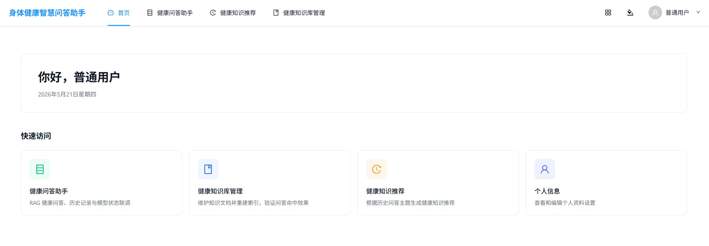

### 健康 RAG 问答

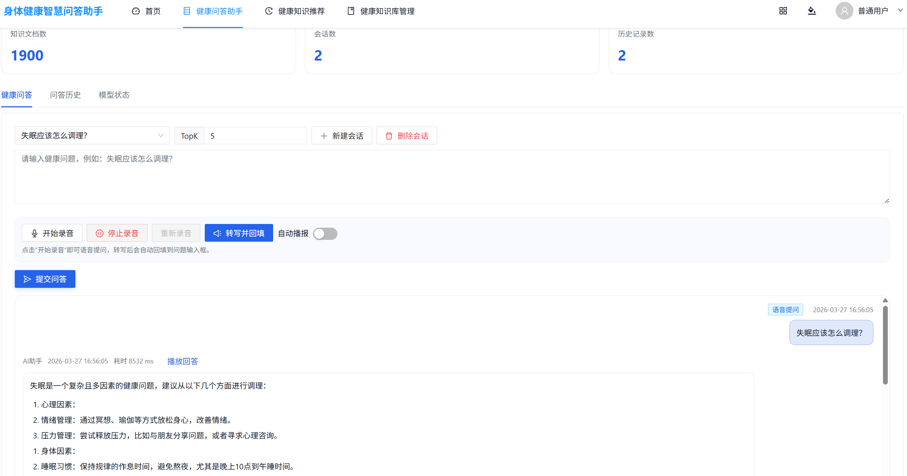

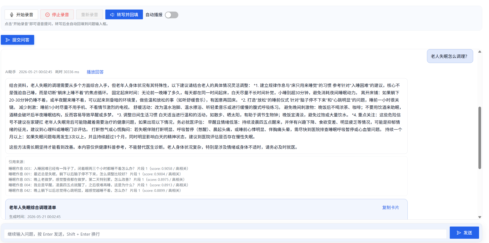

### 健康知识推荐与知识库

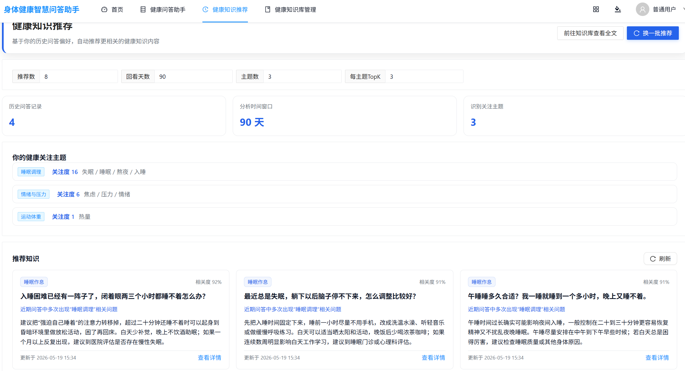

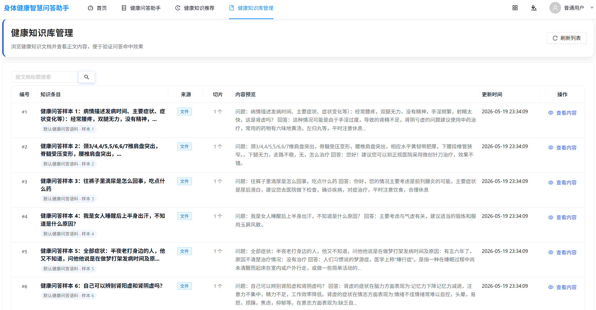

### 后台管理

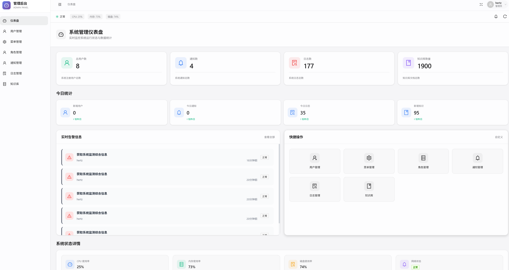

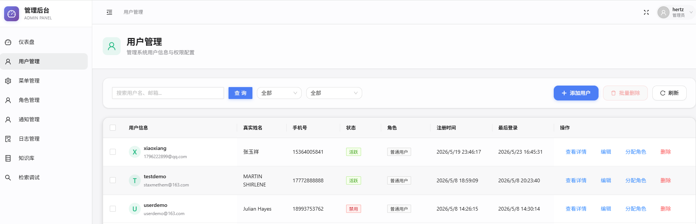

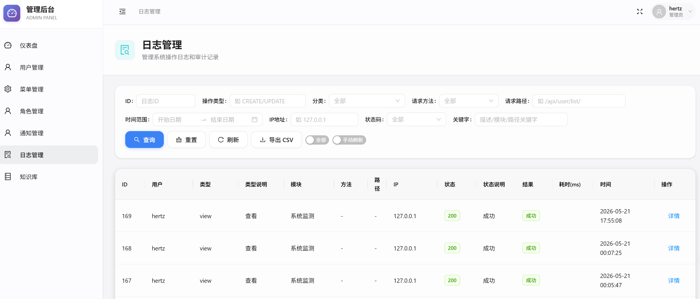

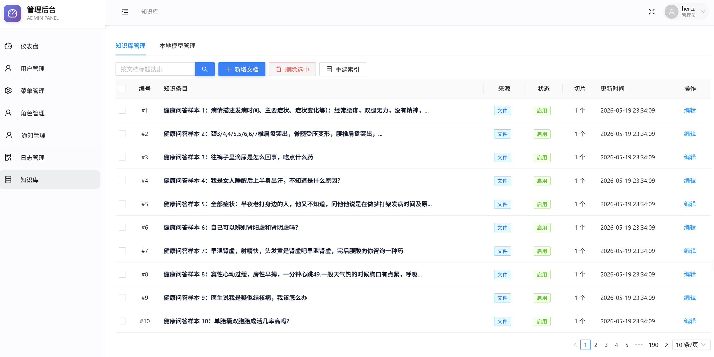

### 评估与调试

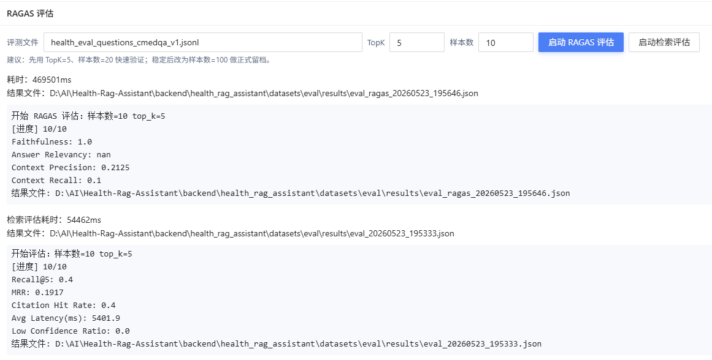
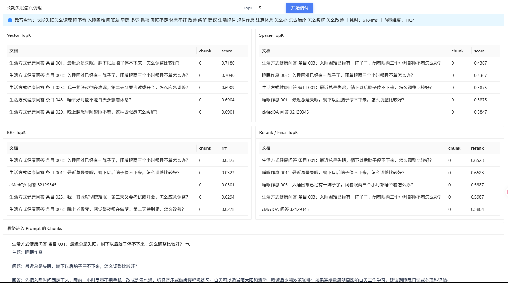

### 服务器部署

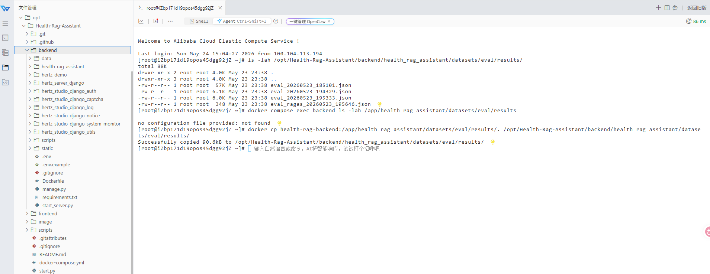
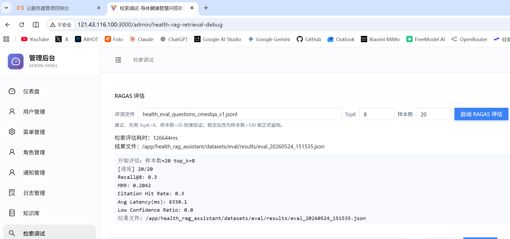

### 启动日志

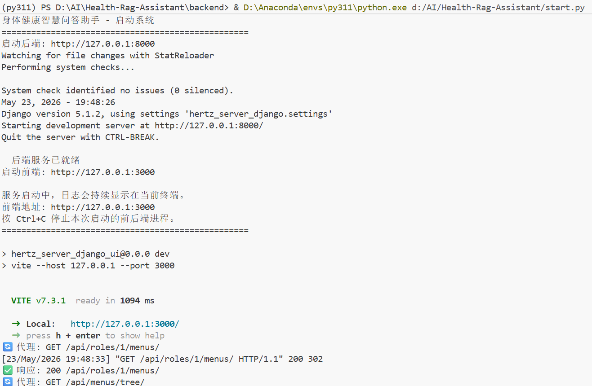

## License

仅用于学习。如需商用，请自行确认模板代码、依赖库、语料数据和第三方服务的授权范围。

## 部署说明

最小部署编排：`docker-compose.yml`  
部署步骤文档：`部署文档.md`

已提供最小 CI/CD 工作流：`/.github/workflows/deploy.yml`  
支持 `push main -> SSH 登录服务器 -> docker compose up -d --build`。
